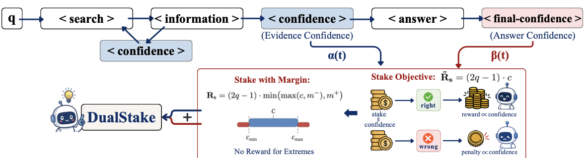

# DualStake: Dual-Path Confidence Calibration in Deep Research Agents

> **Accepted to:** EMNLP 2026 Main Conference

## Overview

Large language model agents equipped with search tools can collect evidence over multiple retrieval rounds, but their expressed confidence is often poorly aligned with answer correctness. We introduce **DualStake**, a confidence-calibration method for deep research agents.

Built on [Search-R1](https://github.com/PeterGriffinJin/Search-R1), DualStake augments the agent trajectory with two confidence signals: **Evidence Confidence**, elicited after retrieval, and **Answer Confidence**, elicited after the final answer. It jointly supervises both signals using a margin-clipped stake reward, improving calibration while preserving answer quality.

<p align="center">
  <a href="assets/overview.png"></a>
</p>

## Getting Started

### Installation

This codebase follows the environment setup of [Search-R1](https://github.com/PeterGriffinJin/Search-R1). After creating that environment, install the dependencies and this package:

```bash
pip install -r requirements.txt
pip install -e .
```

### Data Preparation

Prepare [Search-R1](https://github.com/PeterGriffinJin/Search-R1)-compatible JSONL files containing `question` and `golden_answers`:

```text
/path/to/raw-data/
├── nq/
│   ├── train.jsonl
│   └── test.jsonl
└── hotpotqa/
    ├── train.jsonl
    └── dev.jsonl
```

Build the NQ + HotpotQA training mixture used in the paper:

```bash
python scripts/build_data.py \
  --raw-root /path/to/raw-data \
  --output-dir data/nq_hotpotqa
```

### Retrieval Service

Following [Search-R1](https://github.com/PeterGriffinJin/Search-R1), build or obtain an E5 index over the 2018 Wikipedia corpus, then launch the local retrieval service:

```bash
INDEX_PATH=/path/to/e5_Flat.index \
CORPUS_PATH=/path/to/wiki-18.jsonl \
bash scripts/serve_retriever.sh
```

The default retrieval endpoint is `http://127.0.0.1:8000/retrieve`.

### Training

The training script uses the paper's balanced DualStake setting: GRPO with 5 rollouts, top-3 E5 retrieval, \(\alpha=\beta=0.25\), linear warm-up from steps 100 to 300, and stake clipping to \([0.1, 0.9]\).

```bash
DATA_DIR=./data/nq_hotpotqa \
MODEL_PATH=Qwen/Qwen2.5-7B \
RETRIEVER_URL=http://127.0.0.1:8000/retrieve \
NUM_GPUS=8 \
bash scripts/train_dualstake.sh
```

### Evaluation

Evaluate a base model or trained checkpoint on a prepared benchmark split:

```bash
MODEL_PATH=/path/to/checkpoint \
DATA_DIR=/path/to/benchmark \
OUTPUT_DIR=./evaluation/benchmark \
RETRIEVER_URL=http://127.0.0.1:8000/retrieve \
bash scripts/evaluate.sh
```

Use `scripts/compute_metrics_ext.py` and `scripts/calc_last_step_conf.py` to calculate calibration metrics from generated evaluation statistics.

## Acknowledgements

DualStake is built on [Search-R1](https://github.com/PeterGriffinJin/Search-R1) and includes modified components from [veRL](https://github.com/volcengine/verl). We thank their authors and contributors for making their work available. Please preserve the included `LICENSE` and `Notice.txt` when redistributing this code.
